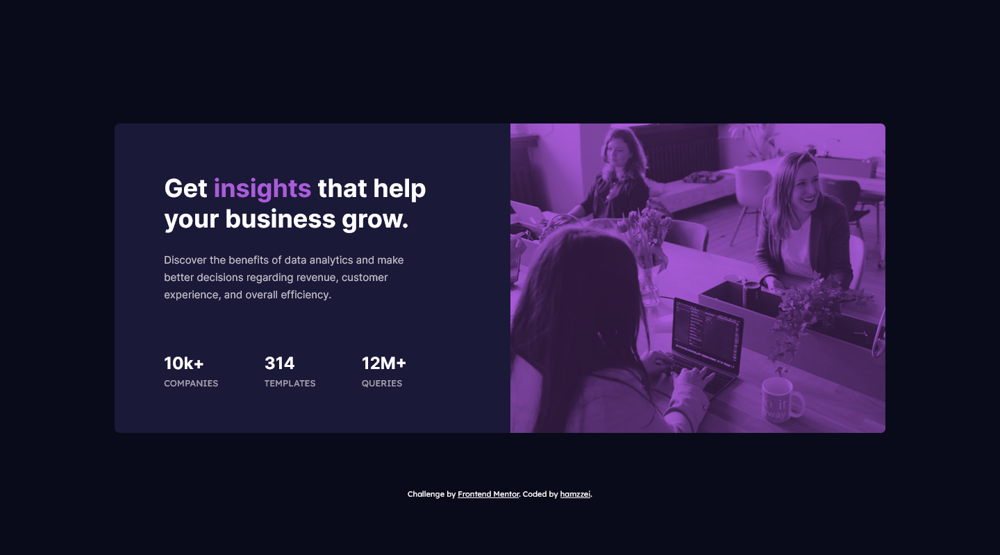

# Frontend Mentor - Stats preview card component solution

This is a solution to the [Stats preview card component challenge on Frontend Mentor](https://www.frontendmentor.io/challenges/stats-preview-card-component-8JqbgoU62). Frontend Mentor challenges help you improve your coding skills by building realistic projects. 

## Table of contents

- [Overview](#overview)
  - [The challenge](#the-challenge)
  - [Screenshot](#screenshot)
  - [Links](#links)
- [My process](#my-process)
  - [Built with](#built-with)
  - [What I learned](#what-i-learned)
  - [Continued development](#continued-development)
  - [Useful resources](#useful-resources)
- [Author](#author)

## Overview

### The challenge

Users should be able to:

- View the optimal layout depending on their device's screen size

### Screenshot



### Links

- Solution URL: [Stats Preview Card Challenge](https://github.com/hamzzei/stats-preview-card-challenge-v2)
- Live Site URL: [hamzzei.github.io](https://hamzzei.github.io/)

## My process

### Built with

- Semantic HTML5 markup
- CSS custom properties
- Flexbox
- CSS Grid
- Mobile-first workflow

### What I learned

The project was built using a mix of Flexbox and Grid. The main thing I learnt in this project was the importance of setting margins in relative units for improving responsivity. Before I would use either em or rem but I found that by using %, vw or vh, the design had a lot more flexibility while also still being easy enough to align with the reference images. 

I also improved my use of classes in the markup in an effort to limit the repitition in my CSS. For example I added a .capitalize class to some of the stats where needed. This got around the problem of some .stats needing to be capitalized and others not, without giving them individual IDs. 

```html
<h2 class="stats">10k+</h2>
<h2 class="stats capitalize">12m+</h2>
<p class="stat_heading capitalize">queries</p>
```
```css
.capitalize {
    text-transform: uppercase;
}
```

This project was also the first time I used the orientation media feature, which was very affective for making sure the main image was in a sensible position no matter how the viewport was changed.

```css
@media (orientation: landscape) and (min-width: 650px) 
```

### Continued development

In future projects I aim to improve my use of classes to keep my CSS clean and avoid repitition. I also want to plan my markup in a way that I shouldn't need to add to it as much once I start working on the CSS. 

I also aim to start adding JavaScript into my future builds!

### Useful resources

- [Pureref](https://www.pureref.com/) - Super useful app for helping to compare and align the reference images with my build. I use it alongside Firefox's Responsive Design Mode.
- [Mozilla](https://developer.mozilla.org/en-US/docs/Web/CSS/@media/orientation) - Mozilla's page on the orientation media feature that I found very helpful.

## Author

- Website - [hamzzei](https://hamzzei.github.io/)
- Frontend Mentor - [@hamzzei](https://www.frontendmentor.io/profile/hamzzei)